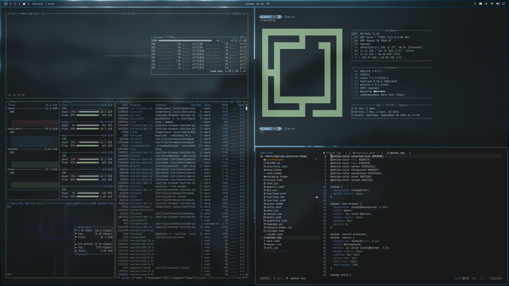

# Nocturne

A calm, minimal dark theme for Omarchy, derived from the
[nocturne.nvim](https://github.com/Alex-Ri/nocturne.nvim) colorscheme for
Neovim. Built for readability, subtle contrast, and a distraction-free desktop.

## Screenshot



## Installation

```bash
omarchy theme install https://github.com/Alex-Ri/omarchy-nocturne-theme.git
```

Or open the Omarchy menu (`Super + Alt + Space`) → **Install > Style > Theme**
and paste the repo URL above.

## Palette

| Token | Color | Hex |
|-------|-------|-----|
| Background | charcoal | `#1B1B1B` |
| Foreground | cool gray | `#D8DEE9` |
| Accent | nord blue | `#5E81AC` |
| Green | nord green | `#A3BE8C` |
| Yellow | amber | `#EBCB8B` |
| Red | muted red | `#D74E42` |
| Cyan | nord cyan | `#8FBCBB` |
| Magenta | muted mauve | `#B48EAD` |
| Muted/comment | gray | `#9A9D9A` |

## Backgrounds

Included in `backgrounds/`:

- `nocturne-night.jpg` — moody night photo
- `nocturne-stars.jpg` — 4K starry sky

Live wallpapers in `videos/`:

- `mist-over-the-pines.3840x2160.mp4` — misty pines, 4K

Video playback requires the omarchy-shell patch (see below).

## What's themed

- Hyprland (window borders, rounded corners, gaps, animations) via `hyprland.conf`
- Omarchy shell and menus (from `colors.toml`)
- Neovim (uses `nocturne.nvim` — see notes below)
- Terminals: Alacritty, Foot, Kitty, Ghostty
- GTK, btop, cava, mako, wofi/walker launchers, SwayOSD
- Chromium, Discord (Vencord), Warp, Vicinae, Superfile

## Notes for installation from a git repo

Omarchy intentionally drops any files that run code when a theme is installed
from a git repo: `*.lua`, terminal configs (`alacritty.toml`, `foot.ini`,
`kitty.conf`, `ghostty.conf`) and `vscode.json`. Those are regenerated from
`colors.toml` instead. This means:

- **Rounded corners** come from the theme's `hyprland.conf`. After installing,
  source it from your config (e.g. add to `~/.config/hypr/hyprland.lua`):
  ```lua
  -- require your theme's hyprland.conf for the Nocturne look
  ```
  or copy the `hyprland.conf` values into `~/.config/hypr/looknfeel.lua`.
- **Neovim**: the `neovim.lua` is regenerated from the default template. To use
  `nocturne.nvim`, install the plugin and set the colorscheme in your LazyVim
  config.

If you install by hand (placing this folder in
`~/.config/omarchy/themes/nocturne/`), every file is kept as-is.

## Live wallpapers

Stock Omarchy only shows static images. To play the videos in `videos/` (or any
`*.mp4`/`*.webm`/`*.mkv`/`*.mov` background), patch `omarchy-shell`:

- `Background.qml` needs a `Video` layer that activates when the selected
  background path is a video file (`/usr/share/omarchy/shell/plugins/background/Background.qml`).
- The background picker needs a patch so it lists `videos/` alongside
  `backgrounds/` (`omarchy-menu-images`).

The patch is not part of this repo — it's your system-level customization.

## Credits

- Palette and vibe: [nocturne.nvim](https://github.com/Alex-Ri/nocturne.nvim)
- Backgrounds: sourced from free wallpaper sites (verify licensing before publishing)
